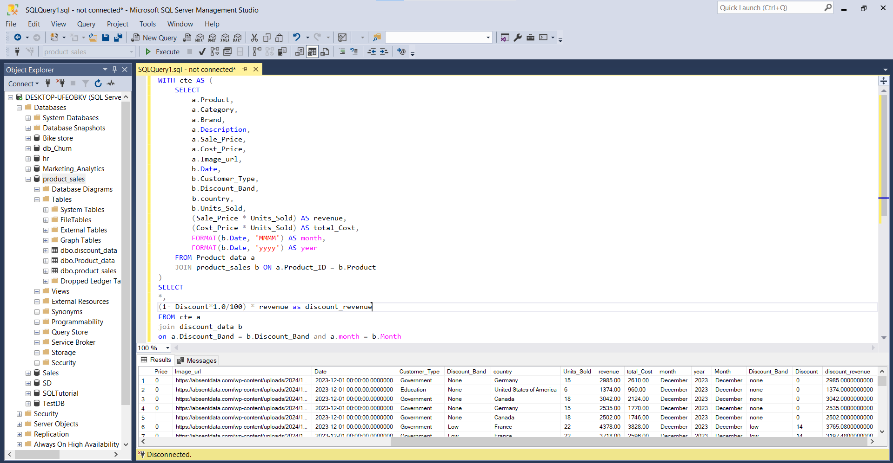

# 📊 Product Analysis Project

An end-to-end product analysis dashboard project using **SQL** and **Power BI**.  
The project analyzes product sales, revenue, profit, and discount impacts across countries and customer types, providing clear business insights through an interactive dashboard.

## 🛠️ Tools Used:
- SQL Server
- Html
- Power Query
- Power BI

📦 Data Preparation (SQL)
I started by preparing and structuring the dataset in SQL Server to calculate essential KPIs like revenue, total cost, and discount-adjusted revenue.

I joined three tables:

Product_data (product details)

product_sales (sales transactions)

discount_data (discount percentages by band and month)

This merge allowed me to combine product information, transaction records, and discount policies into one comprehensive dataset.

Then, I created a Common Table Expression (CTE) to:

Calculate Revenue = Sale Price × Units Sold

Calculate Total Cost = Cost Price × Units Sold

Extract Month and Year from the sale date

Using a CTE helped simplify the query structure and enabled further calculations.

Finally, I calculated the discount-adjusted revenue by joining the CTE with discount_data based on both Discount Band and Month, then applying the discount formula to the original revenue.

### 📸 Query Result Screenshot:

