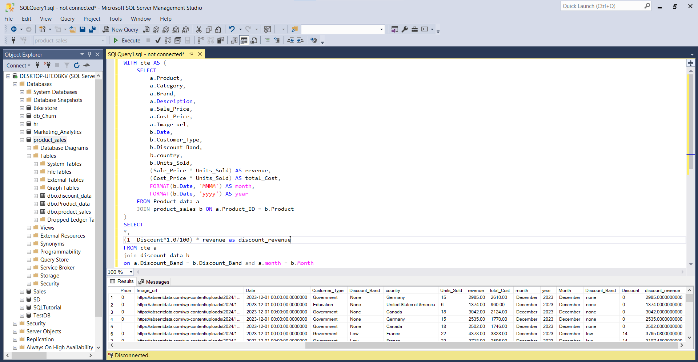
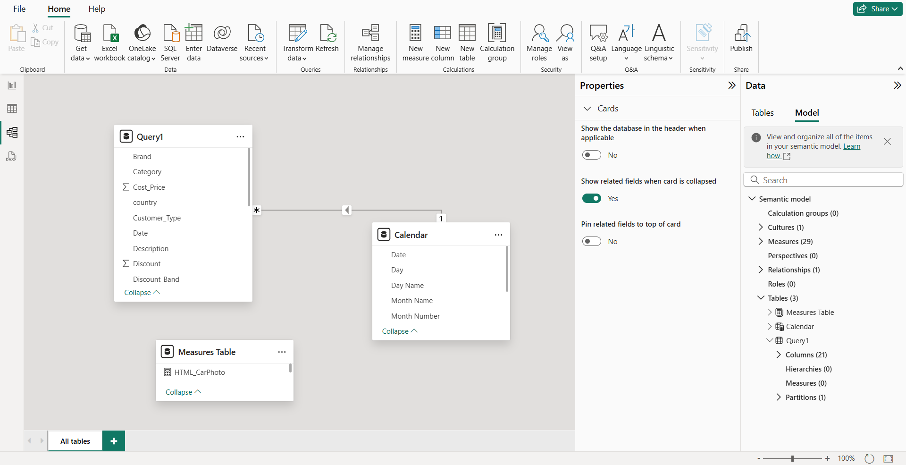
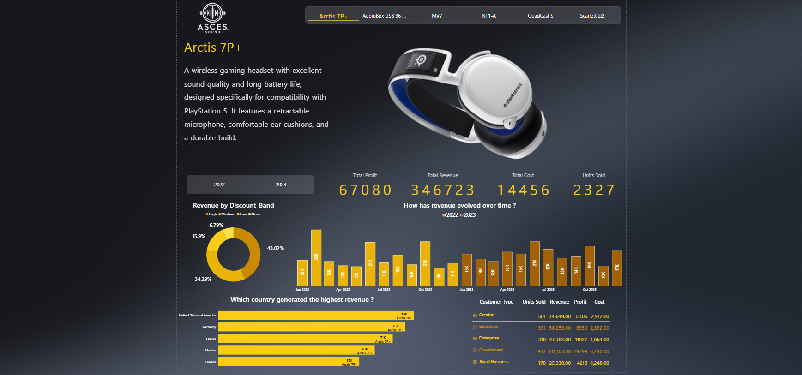

# 📊 Product Analysis Project

An end-to-end product analysis dashboard project using **SQL** and **Power BI**.  
The project analyzes product sales, revenue, profit, and discount impacts across countries and customer types, providing clear business insights through an interactive dashboard.

## 🛠️ Tools Used:
- SQL Server
- Html
- Power Query
- Power BI

📦 Data Preparation (SQL)
I started by preparing and structuring the dataset in SQL Server to calculate essential KPIs like revenue, total cost, and discount-adjusted revenue.

I joined three tables:

Product_data (product details)

product_sales (sales transactions)

discount_data (discount percentages by band and month)

This merge allowed me to combine product information, transaction records, and discount policies into one comprehensive dataset.

Then, I created a Common Table Expression (CTE) to:

Calculate Revenue = Sale Price × Units Sold

Calculate Total Cost = Cost Price × Units Sold

Extract Month and Year from the sale date

Using a CTE helped simplify the query structure and enabled further calculations.

Finally, I calculated the discount-adjusted revenue by joining the CTE with discount_data based on both Discount Band and Month, then applying the discount formula to the original revenue.

### 📸 Query Result Screenshot:

📊 Data Loading (Power BI)
After preparing the data in SQL Server, I connected Power BI to the database using DirectQuery mode.

This approach ensures real-time data interaction with the SQL database, enabling any updates in the SQL Server to reflect immediately in Power BI reports without the need for manual refresh.

Power_BI_Connection.png

## DAX & HTML 

💡 Function:

Displays a car image.

Adds an interactive dot marker on the image.

Shows a tooltip with quick car information when hovering over the dot.

📄 HTML_Overview.html
💡 Function:
- Displays the car model name.
📄 HTML_Total_Cost.html
💡 Function:
- Displays the total cost value.
📄 HTML_Total_Profit.html
💡 Function:
- Displays the total profit value.

## DAX Measures

1️⃣ KPI_Cost
Description:
- Calculates the total cost price for the currently selected product.

2️⃣ KPI_Profit
Description:
- Calculates the total profit for the currently selected product.

3️⃣ KPI_Revenue
Description:
- Calculates the total revenue for the currently selected product.

4️⃣ KPI_Units_Sold
Description:
- Calculates the total number of units sold for the currently selected product.

5️⃣ Overview_ProductInformation
Description:
- Retrieves the description for the currently selected product.

📊 Dashboard Overview
This interactive dashboard provides a detailed analysis of product performance, specifically for the Arctis 7P+ model. It’s designed to deliver actionable business insights through a clean and visually appealing interface.

📌 Dashboard Components:
📌 Header
Logo and Brand Name: Positioned top-left.

Product Navigation Tabs: Allows users to switch between different product dashboards.

📌 Product Overview
Product Name & Description: Displayed on the left side with animated appearance.

Product Image: Shown on the right for quick visual identification.

📌 KPI Cards
Located at the top-center displaying key metrics for the selected product:

Total Profit

Total Revenue

Total Cost

Units Sold
All values are dynamically updated based on the selected product.

📌 Time-Based Revenue Analysis
Bar Chart showing how revenue evolved over months, comparing between years 2022 and 2023.

📌 Revenue by Discount Band
Donut Chart visualizing the revenue distribution by discount levels:

High

Medium

Low

None

📌 Country-Wise Revenue Leaderboard
Horizontal Bar Chart ranking countries by revenue generated for the selected product.

📌 Customer Type Breakdown
Table View displaying:

Units Sold

Revenue

Profit

Cost
for each customer category:

Creator

Education

Enterprise

Government

Small Business

